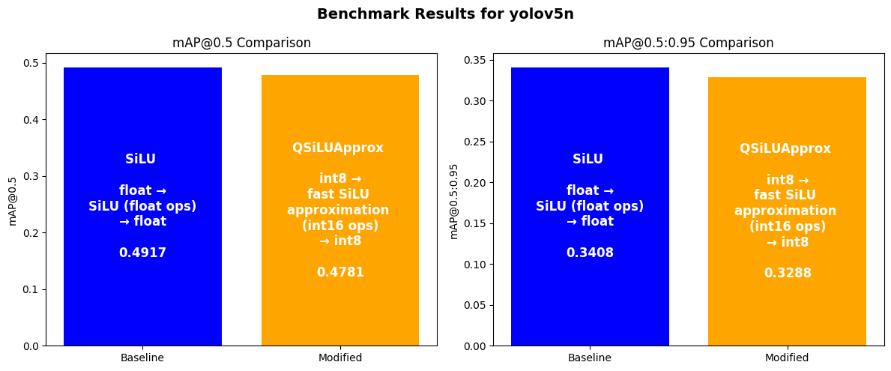

[](https://colab.research.google.com/github/BoumedineBillal/object-detection-yolo/blob/main/notebooks/benchmark_qsilu.ipynb)

# SiLU Quantizer for Embedded AI



This project provides an efficient approximation of the **SiLU activation function** optimized for **quantized inference** on embedded devices, specifically targeting the **ESP32-P4**.

## 📖 Blog Post  
A detailed explanation of the method and implementation is available here:  
🔗 **[ESP32-P4 Deep Learning Pipeline: Approximating SiLU for Efficient Quantization](https://boumedinebillal.blogspot.com/2025/02/esp32-p4-deep-learning-pipeline-update.html)**

## 📄 Reference Paper  
The sigmoid approximation used in this project is based on:  
🔗 **[Computationally Efficient Approximations of S-Shape Functions](https://www.researchgate.net/publication/311777918_Computationally_Efficient_Methods_of_Approximations_of_the_S-Shape_Functions_for_Image_Processing_and_Computer_Graphics_Tasks#full-text)** (Page 20)

## 🚀 Features  
- **Fast bitwise approximation** of SiLU using a quadratic sigmoid function.  
- **Optimized for MCUs** with efficient shift-based computation.  
- **Maintains high accuracy** in the key range **[-4, 4]** while preserving expected SiLU behavior.

## 🔧 Installation  
Clone the repository and follow the usage instructions in the blog post:

```sh
git clone https://github.com/BoumedineBillal/silu_quantizer.git
cd silu_quantizer
```

## 🤝 Contributions  
Contributions are welcome! Feel free to open an issue or submit a pull request.

📩 **Questions?** Reach out via [GitHub Issues](https://github.com/BoumedineBillal/silu_quantizer/issues).
